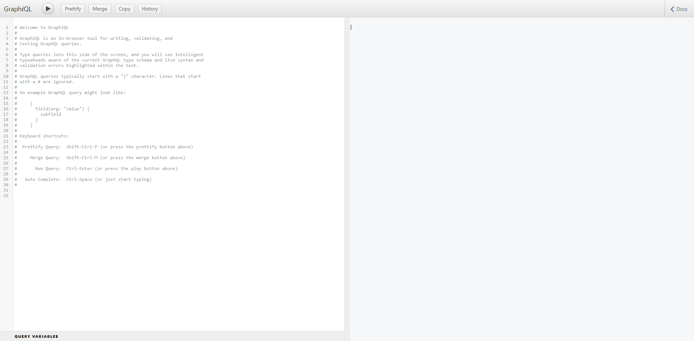

# Private Ethereum Blockchain
Using JSON-RPC with GraphQL modules in conjunction with Express, a private ethereum gas-free network can be created with support for truffle and metamask coneectivity.

When using a private ethereum network, should be placed behind a firewall with restricted access to the public facing internet.

# GraphQL-UI
Navigate to,

    http://localhost:8545/graphql/ui

to view,

